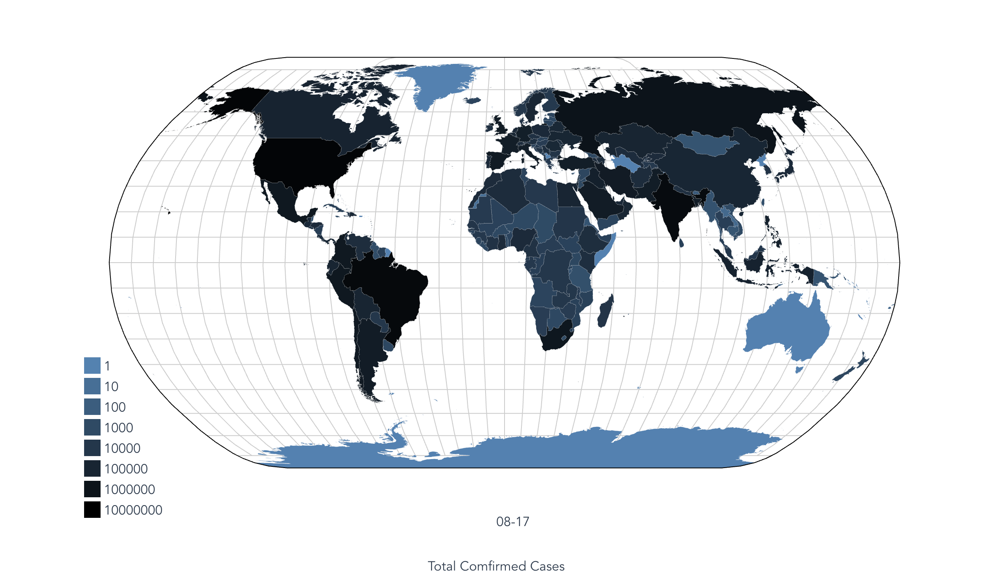
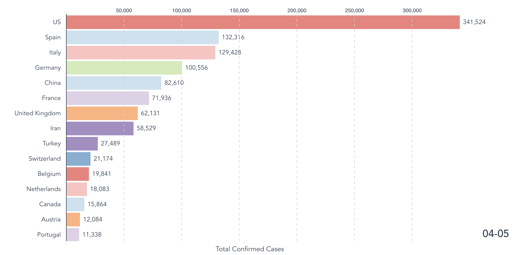
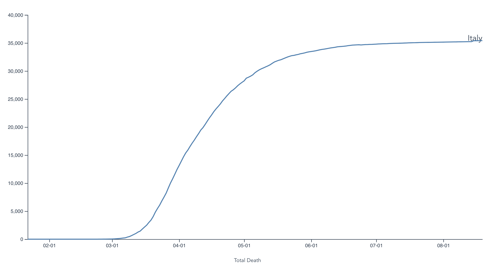
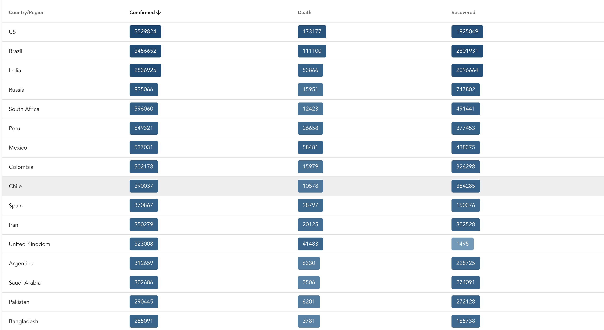

# visual-covid
Data visualization of coronavirus infection built using Vue and d3js\
Data comes from JHU\
[visual-covid](http://alexwang000.github.io/visual-covid)
# Demo
Try the website [here](http://alexwang000.github.io/visual-covid)




# To run locally
Clone and
```
npm install
npm run serve
```
